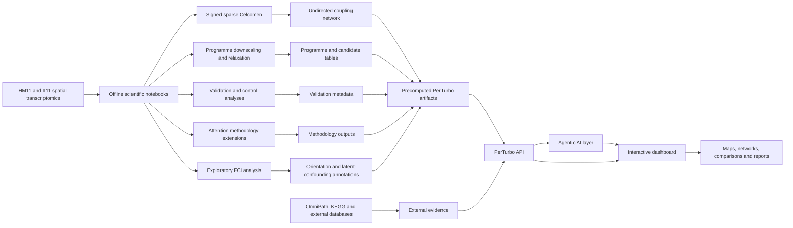

# MLCB2026_Assignment_Final

# PerTurbo

**PerTurbo is an agentic AI platform for exploring in silico gene perturbations in spatial transcriptomics.**

It connects spatial gene-expression analysis, Celcomen-based modelling, programme perturbation, exploratory causal discovery, gene-coupling networks, external biological evidence and an interactive natural-language interface.

PerTurbo was developed using matched primary and metastatic pancreatic ductal adenocarcinoma tissue sections. The scientific analyses are performed offline, and their outputs are presented through an interactive dashboard and an agentic AI system.

PerTurbo is designed for:

- biological exploration;
- candidate-gene prioritisation;
- programme-level perturbation analysis;
- comparison of primary and metastatic tissue;
- spatial visualisation;
- network exploration;
- causal-hypothesis generation;
- external evidence retrieval.

The outputs are model-derived hypotheses and require independent experimental validation.

---

# Data

We used spatial gene-expression information from matched primary and metastatic pancreatic ductal adenocarcinoma tissue sections published by Khaliq et al. [7].

The samples were profiled using the **10x Genomics Visium spatial transcriptomics platform**.

Each Visium spot captures the pooled RNA expression of a small group of neighbouring cells while preserving the spatial location of that spot inside the tissue section.

The dataset contains:

- **T11**: a primary pancreatic ductal adenocarcinoma tissue section;
- **HM11**: a matched metastatic tissue section from the same patient.

The data are available through GEO accession:

> **GSE272362**

Because the sections originate from the same patient, they provide a matched primary-versus-metastasis comparison. They do not provide independent patient-level replication.

---

# Extension of Celcomen

We used Celcomen as the main modelling framework and extended the analytical workflow to include:

- signed gene-to-gene couplings;
- sparse coupling matrices;
- fibrotic- and tumour-programme definitions;
- programme-level initial-state downscaling;
- model relaxation after perturbation;
- spatial-response analysis;
- seed and control analyses;
- graph-attention model extensions;
- constant-row-mass attention;
- undirected network visualisation;
- exploratory causal-discovery analysis;
- comparison with external pathway information;
- integration with the PerTurbo agentic application.

The Celcomen coupling matrix is symmetric. Therefore, its gene-to-gene relationships are presented as **undirected fitted couplings** and not as data-derived causal arrows.

---

# Scientific notebooks

The repository contains four scientific notebooks.

Each notebook performs a different part of the analysis.

---

## `validation_Experiments.ipynb`

This notebook performs the main programme-perturbation and validation analysis.

It includes:

- loading the matched HM11 and T11 tissue sections;
- fitting signed and sparse Celcomen coupling models;
- defining fibrotic and tumour-related gene programmes;
- selecting programme genes for perturbation;
- reducing selected genes in the initial model state;
- allowing expression to relax under the fitted model;
- measuring the resulting tumour-programme response;
- comparing selected programmes with matched random gene sets;
- examining sensitivity across model seeds;
- evaluating spatial localisation;
- performing graph-shuffling controls;
- examining random-niche controls;
- evaluating combined programme responses;
- identifying limitations in the available controls.

The perturbation is performed by changing the **initial model state**.

The genes are allowed to change again during relaxation.

The procedure is therefore described as:

> **Initial programme downscaling followed by model relaxation**

It is not a permanent biological gene knockout.

The purpose of this notebook is to perform the biological programme analysis and provide the controls required for its interpretation.

---

## `Methodology_Extensions.ipynb`

This notebook develops and evaluates methodological extensions of the Celcomen workflow.

It contains four models.

### Model 1: signed sparse Celcomen

This model estimates a symmetric signed and sparse gene-to-gene coupling matrix.

It is used to examine:

- coupling density;
- programme-level coupling;
- sparsity;
- seed sensitivity;
- programme responses after initial-state downscaling.

### Model 2: graph-attention autoencoder

This model uses graph attention to reconstruct spatial expression.

It is used to examine:

- sender-to-receiver spatial aggregation;
- expression reconstruction;
- attention weights;
- spatial localisation;
- transfer to a held-out spatial region.

### Model 3: constrained fibrotic-to-tumour GGAT

This model uses fibrotic-programme expression as the predictor and tumour-programme expression as the target.

It is used to examine:

- fibrotic-sender to tumour-receiver relationships;
- attention-weighted programme responses;
- comparison with uniform aggregation;
- transfer to a held-out spatial region.

### Model 4: constant-row-mass attention

This model compares learned attention with uniform neighbour aggregation.

Each receiving spot has the same total incoming neighbour mass.

It is used to examine:

- receiver-row mass;
- graph implementation;
- uniform-versus-attention aggregation;
- trainable parameter counts;
- spatial hold-out behaviour;
- matched programme permutation tests;
- attention-based programme responses.

The purpose of this notebook is to evaluate whether attention-based extensions provide useful spatial information beyond the Celcomen baseline.

The notebook evaluates the implementation and model behaviour. It does not claim that learned attention automatically preserves the original Celcomen identifiability result.

---

## `HM11_Undirected_Network.ipynb`

This notebook creates the main gene-coupling network for the HM11 metastatic tissue section.

It includes:

- loading the fitted HM11 gene-to-gene coupling matrix;
- checking that the matrix is sufficiently symmetric;
- removing negligible numerical asymmetry;
- ranking gene pairs by coupling magnitude;
- selecting the strongest fitted relationships;
- separating positive and negative couplings;
- building an undirected gene network;
- annotating genes by niche or biological programme;
- exporting the network figure;
- exporting the network edge table.

The network is presented as:

> **Undirected signed Celcomen coupling network**

The figure uses lines rather than arrows.

The network visualises fitted relationships without assigning causal direction.

Positive and negative values refer to the sign of the fitted coupling. They do not independently establish biological activation, inhibition or causation.

---

## `Causality.ipynb`

This notebook performs an exploratory causal-discovery analysis using the observed spatial-expression data.

It includes:

- selecting stromal- and tumour-programme genes;
- adjusting for measured spatial and technical covariates;
- transforming the data for conditional-independence testing;
- applying the Fast Causal Inference algorithm;
- repeating the analysis across spatial-block resamples;
- evaluating graph stability;
- examining directed patterns;
- examining undirected patterns;
- examining circular endpoint patterns;
- examining bidirected patterns compatible with latent confounding;
- performing sensitivity analyses;
- comparing observational patterns with OmniPath and KEGG information.

The purpose of this notebook is to examine whether the observational spatial-expression data support stable orientations between programme genes.

FCI examines possible latent confounding at the level of individual gene pairs.

It does not identify the biological identity of an unmeasured common factor.

Directions from OmniPath and KEGG are treated as:

> **External curated biological priors**

They are not presented as causal directions learned directly from the Celcomen matrix or from the HM11 and T11 expression data.

---

# Notebook workflow

The notebooks can be followed in the following order:

1. `validation_Experiments.ipynb`  
   Programme perturbation and validation controls.

2. `Methodology_Extensions.ipynb`  
   Celcomen and graph-attention methodology extensions.

3. `HM11_Undirected_Network.ipynb`  
   Visualisation of the main undirected Celcomen network.

4. `Causality.ipynb`  
   Exploratory causal-discovery and orientation-stability analysis.

This workflow moves from programme perturbation, to methodological evaluation, to network visualisation, and finally to exploratory causal discovery.

---

# PerTurbo application

PerTurbo is the interactive application developed on top of the scientific analyses.

The notebooks perform the computationally expensive model fitting, perturbation experiments, validation analyses and causal-discovery procedures.

Their outputs are converted into structured files containing:

- candidate-gene information;
- biological population information;
- programme perturbation results;
- spatial-response values;
- network relationships;
- model and validation metadata;
- causal-discovery annotations;
- external biological evidence.

The PerTurbo application reads these precomputed outputs and allows a researcher to explore them interactively.

The models do not need to be retrained every time a user asks a question.

---

# Agentic AI system

PerTurbo includes an **agentic AI layer**.

The agent receives a user question in natural language and selects the appropriate tools, data and visualisations required to answer it.

For example, a researcher may ask:

> Which biological population should be prioritised in the metastatic section?

The agent can then:

1. identify that the question refers to HM11;
2. retrieve the relevant precomputed population rankings;
3. inspect the corresponding programme genes;
4. retrieve the predicted model response;
5. request the relevant spatial map;
6. retrieve the coupling-network neighbourhood;
7. request external evidence for selected genes;
8. organise the information into a structured explanation;
9. guide the dashboard through the relevant visualisations;
10. state the limitations of the result.

This creates a multi-step analytical workflow rather than a single text response.

The agent is used to coordinate and explain the available evidence.

It does not independently calculate the scientific measurements.

The numerical results are generated by the notebooks and precomputation pipeline.

---

# Language-model backend

The PerTurbo agent uses an OpenAI-compatible language-model interface through the **Fireworks AI API**.

The language-model layer is used to:

- understand natural-language questions;
- select the correct analysis tools;
- organise precomputed results;
- explain gene and programme information;
- generate a narrated analysis sequence;
- compare sections;
- present external evidence;
- describe uncertainty;
- state methodological limitations.

The language model is not the source of the scientific measurements.

It receives structured scientific outputs and converts them into an accessible explanation.

The structured application endpoints can continue to serve scientific data even when the language-model service is unavailable.

---

# Main PerTurbo functions

## Target and population discovery

PerTurbo allows the user to explore candidate genes and biological populations in either tissue section.

The interface can display:

- section;
- biological population;
- number of source spots;
- programme genes;
- predicted tumour-programme response;
- spatial information;
- model evidence;
- validation information;
- external evidence.

The results represent in silico prioritisation and not clinically validated targets.

---

## Candidate-gene evaluation

A researcher can provide a list of genes.

PerTurbo can compare the submitted genes with the available scientific evidence and organise them into categories such as:

- prioritise;
- consider;
- deprioritise;
- insufficient evidence.

Each candidate can be accompanied by information from:

- programme perturbation;
- coupling relationships;
- causal-discovery analysis;
- spatial maps;
- literature;
- drug-gene databases;
- clinical-trial databases.

---

## Primary-versus-metastasis comparison

PerTurbo can compare the same gene or biological population between:

- **T11 primary tumour**;
- **HM11 metastasis**.

The comparison can show:

- whether a candidate appears in both sections;
- whether its fitted response differs between sections;
- whether the source population differs;
- whether the spatial distribution differs;
- whether external evidence is available.

Because both sections originate from the same patient, this is a matched tissue comparison and not independent patient-level validation.

---

## Spatial maps

PerTurbo displays spatial maps of model-derived responses.

The maps allow the user to examine:

- the selected source population;
- the location of tumour-related spots;
- the magnitude of the predicted response;
- the distribution of the response across the tissue;
- whether the response appears local or tissue-wide.

The maps display model predictions and not experimentally measured treatment responses.

---

## Coupling network

PerTurbo displays the signed Celcomen relationships as an interactive network.

The main data-derived network is undirected.

The user can:

- inspect positive fitted couplings;
- inspect negative fitted couplings;
- focus on a selected gene;
- display neighbouring genes;
- identify highly connected genes;
- filter the network;
- distinguish fitted Celcomen relationships from external pathway information.

Directed pathway relationships, when displayed, are clearly labelled as external curated information.

---

## Exploratory causal information

PerTurbo can display information from the exploratory FCI analysis.

This may include:

- undirected relationships;
- possible directed orientations;
- possible latent-confounding patterns;
- stability across spatial resamples;
- sensitivity-analysis information;
- comparison with external pathway priors.

The causal-discovery information is presented as hypothesis-supporting evidence.

It is not presented as experimentally established gene-to-gene causation.

---

## External biological evidence

PerTurbo can retrieve information from external databases such as:

- Open Targets;
- DGIdb;
- Europe PMC;
- ClinicalTrials.gov;
- OmniPath;
- KEGG.

The evidence layer can provide:

- disease associations;
- known drug-gene interactions;
- relevant publications;
- registered clinical studies;
- known pathway relationships;
- therapeutic-development context.

An external record does not independently validate a model prediction.

It provides additional biological and clinical context.

---

## Agent-guided presentation

The agent can create a sequence of dashboard actions.

A response may include:

1. an explanation of the selected tissue section;
2. a ranked population view;
3. a candidate-gene table;
4. a spatial map;
5. a network view;
6. external evidence;
7. a comparison between primary and metastatic tissue;
8. a summary of limitations.

The user therefore receives both a written explanation and an interactive analytical sequence.

---

## Report generation

PerTurbo can generate a structured report containing:

- the research question;
- selected tissue section;
- ranked populations;
- candidate genes;
- programme-response information;
- spatial maps;
- coupling-network information;
- exploratory causal evidence;
- external evidence;
- the agent's interpretation;
- methodological limitations;
- provenance of the displayed results.

The report can be exported for browser viewing, printing or PDF generation.

---

# How the components connect



---

# Scientific and application separation

The project separates the scientific computations from the runtime application.

## Offline scientific layer

The notebooks and precomputation workflow perform:

- data preprocessing;
- model fitting;
- programme perturbation;
- relaxation experiments;
- validation analyses;
- graph-attention experiments;
- network generation;
- causal-discovery analysis.

These analyses generate structured output files.

## Runtime application layer

The PerTurbo application reads the saved output files.

It provides:

- fast API responses;
- interactive visualisation;
- natural-language interaction;
- external evidence retrieval;
- report generation.

This separation allows the scientific analyses to be inspected independently from the language-model interface.

---

# Live demo

The interactive dashboard is available at:

https://plazanas.github.io/PerTurbo-Dashboard/

Frontend source code:

https://github.com/plazanas/PerTurbo-Dashboard

The dashboard repository contains the interactive user interface and presentation logic.

This repository contains the scientific notebooks and analytical foundation.

---

# Repository contents

```text
Causality.ipynb
    Exploratory causal-discovery analysis using FCI, spatial resampling
    and external pathway information.

HM11_Undirected_Network.ipynb
    Undirected signed Celcomen coupling network for the HM11 metastatic
    tissue section.

Methodology_Extensions.ipynb
    Signed sparse Celcomen baseline and graph-attention methodology
    extensions.

validation_Experiments.ipynb
    Programme perturbation experiments, spatial analyses and validation
    controls.

README.md
    Description of the data, scientific notebooks and PerTurbo
    application.
```

---

# Technology

## Scientific analysis

- Python;
- Jupyter Notebook;
- Google Colab;
- Celcomen;
- Scanpy;
- AnnData;
- NumPy;
- pandas;
- SciPy;
- PyTorch;
- PyTorch Geometric;
- causal-learn;
- statsmodels;
- NetworkX;
- Matplotlib.

## Application

- Flask API;
- OpenAI-compatible Fireworks API;
- agentic language-model workflow;
- JavaScript dashboard;
- Chart.js;
- HTML report export;
- PDF report export.

## External evidence sources

- Open Targets;
- DGIdb;
- Europe PMC;
- ClinicalTrials.gov;
- OmniPath;
- KEGG.

---

# Responsible interpretation

PerTurbo is designed for hypothesis generation and candidate prioritisation.

The application should describe results using terms such as:

- model-derived response;
- fitted coupling;
- in silico candidate;
- exploratory causal hypothesis;
- external curated direction;
- requires experimental validation.

The application should not describe results as:

- a proven therapeutic target;
- an experimentally confirmed causal gene;
- a validated clinical treatment;
- a causal direction established by Celcomen alone.

The term causal in this project refers to the combination of:

1. model-based programme perturbation;
2. observational causal-discovery analysis;
3. stability and control analyses;
4. external pathway evidence;
5. transparent hypothesis prioritisation.

It does not mean that biological causality has been independently demonstrated.

---

# Celcomen and licensing

The modelling workflow uses Celcomen as an installed scientific dependency.

Celcomen is distributed under the GPL-3.0 licence.

The scientific notebooks and offline components that depend on Celcomen should be used in an environment compatible with the Celcomen licence.

The runtime agent and dashboard read precomputed output files and do not need to retrain Celcomen during user interaction.

Celcomen is credited as the underlying spatial modelling framework used in this project.

---

# Team and affiliation

This project was developed by:

- **Evangelia Kourtzelli**
- **Ioulios Konstantelos**
- **Panagiotis Lazanas**

**MSc Data Science and Information Technologies**  
**National and Kapodistrian University of Athens**

